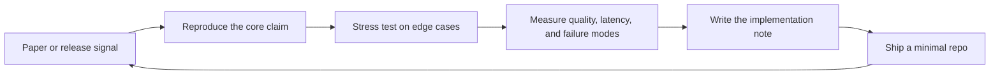

# Ruazzm

LLM algorithms and systems: reasoning, post-training, agentic retrieval, and efficient inference.

I build small but inspectable systems around frontier model behavior: how models reason, how they use tools, how retrieval changes answers, and how serving constraints shape real applications.

## Current Focus

| Track | What I am looking for | What I build |
| --- | --- | --- |
| Reasoning and post-training | RL with verifiable rewards, long-CoT distillation, process supervision, test-time compute | reasoning eval harnesses, reward hacking audits, ablation reports |
| Agentic systems | tool-use planning, MCP-style tool interfaces, long-running coding agents, memory files | task agents with traceable state and failure analysis |
| Retrieval and memory | GraphRAG, query planning, reranking, contextual retrieval, long-context routing | grounded QA pipelines with hallucination and attribution metrics |
| Inference systems | speculative decoding, KV-cache compression, prompt caching, continuous batching, MoE routing | low-latency serving experiments and cost/quality dashboards |
| Multimodal foundation models | native multimodality, video understanding, UI/computer-use agents | multimodal data curation and evaluation probes |

## Research Operating Loop

## Frontier Radar

<!-- FRONTIER-RADAR:START -->
_Auto-updated on 2026-06-01 UTC from arXiv recent submissions._

| Track | Fresh signals |
| --- | --- |
| Reasoning / RLVR | [LongTraceRL: Learning Long-Context Reasoning from Search Agent Trajectories with Rubric Rewards](http://arxiv.org/abs/2605.31584v1) (2026-05-29) [Disagreeing Rationales: Rethinking Classification and Explainability Evaluation in Hate Speech Detection](http://arxiv.org/abs/2605.31563v1) (2026-05-29) [What Am I Missing? Question-Answering as Hidden State Probing](http://arxiv.org/abs/2605.31561v1) (2026-05-29) |
| Agents / tool use | Curated fallback: [Anthropic Claude 4: extended thinking and tool use](https://www.anthropic.com/news/claude-4) [Model Context Protocol](https://www.anthropic.com/news/model-context-protocol) |
| RAG / memory | Curated fallback: [Microsoft GraphRAG](https://www.microsoft.com/en-us/research/project/graphrag/) [Contextual retrieval](https://www.anthropic.com/news/contextual-retrieval) |
| Inference / serving | [LongTraceRL: Learning Long-Context Reasoning from Search Agent Trajectories with Rubric Rewards](http://arxiv.org/abs/2605.31584v1) (2026-05-29) [Mellum2 Technical Report](http://arxiv.org/abs/2605.31268v1) (2026-05-29) [GRKV: Global Regression for Training-Free KV Cache Compression in Long-Context LLMs](http://arxiv.org/abs/2605.31105v1) (2026-05-29) |
| Multimodal models | Curated fallback: [Qwen3: hybrid thinking modes](https://qwenlm.github.io/blog/qwen3/) [Llama 4: native multimodal MoE models](https://ai.meta.com/blog/llama-4-multimodal-intelligence/) [Gemini 3.1 Pro model card](https://deepmind.google/models/model-cards/gemini-3-1-pro) |
<!-- FRONTIER-RADAR:END -->

## Work I Want My GitHub To Signal

- I care about implementation details, not just model names.
- I prefer benchmarks with inspectable failure cases over leaderboard-only claims.
- I treat RAG as a retrieval and attribution system, not a prompt template.
- I track the cost side of intelligence: context length, cache behavior, batching, and token budgets.
- I write down negative results because they are often the most useful part of the experiment.

## Public Artifacts To Pin

| Repo idea | Why it looks technically deep |
| --- | --- |
| `reasoning-eval-lab` | Compare thinking/non-thinking modes, majority voting, self-consistency, and verifier reranking on math/code tasks. |
| `agent-trace-bench` | Run tool-use agents with full traces, recovery statistics, and error taxonomy. |
| `rag-failure-atlas` | Collect hallucination, citation drift, entity confusion, and stale-context failures. |
| `kv-cache-playground` | Measure long-context latency and memory under cache quantization/compression settings. |
| `llm-posttraining-notes` | Keep concise notes on SFT, DPO/IPO/ORPO, RLVR, rejection sampling, and reward hacking. |

## Reading Filters

I keep a paper or release note only if it changes at least one of these:

- the training recipe,
- the inference-time algorithm,
- the agent/tool interface,
- the evaluation method,
- the deployment cost model,
- or the failure analysis.
