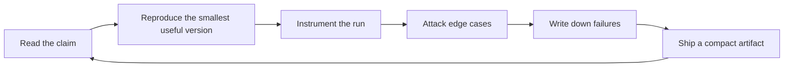

# Ruazzm

I work on LLM algorithms and systems, especially the places where a model stops being a benchmark number and starts becoming an inspectable system: post-training, reasoning-time compute, retrieval, agent traces, and serving efficiency.

My bias is simple: a good AI repo should leave evidence. Not just a demo, but the configs, prompts, traces, eval slices, latency numbers, failure cases, and notes that make the result debuggable by someone else.

## Current Workbench

| Track | Questions I care about | What I try to make visible |
| --- | --- | --- |
| Reasoning and post-training | When does extra thinking improve accuracy rather than verbosity? How do verifier and reward signals fail? | task slices, policy deltas, self-consistency curves, reward hacking examples |
| Agent systems | Can an agent explain what it tried, why it retried, and where it lost state? | tool-call traces, recovery logs, state snapshots, error taxonomies |
| Retrieval and memory | Is the answer grounded, or just confidently adjacent to retrieved text? | attribution checks, stale-context tests, entity collision cases, reranker ablations |
| Inference and serving | What quality is bought by each extra token, cache entry, and batch slot? | latency and memory dashboards, prompt-cache hit rates, KV-cache experiments |
| Multimodal models | Where do UI and video models confuse spatial state, temporal order, or instruction scope? | curated probes, frame-level failures, data-cleaning notes |

## Operating Loop

## What I Want My Public Work To Signal

- The interesting part of an LLM system is often the interface between algorithm and measurement.
- I trust experiments more when the failure cases are easier to inspect than the headline metric.
- RAG is an attribution problem before it is a prompt template.
- Agents need replayable state, not just a transcript.
- Serving details change product behavior: context length, caching, batching, routing, and token budgets all leak into UX.
- Negative results are useful when they are specific enough to save someone else a week.

## Project Map

| Artifact | Current shape | Why it should exist |
| --- | --- | --- |
| `reasoning-eval-lab` | eval harness design | Compare direct answering, thinking budgets, self-consistency, verifier reranking, and tool-assisted solving on the same slices. |
| `agent-trace-bench` | trace schema and failure taxonomy | Store agent state, tool calls, retries, recovery attempts, and final failure causes in a replayable format. |
| `rag-failure-atlas` | casebook and metrics | Separate stale retrieval, citation drift, entity collision, missing context, and multi-hop failures instead of calling everything hallucination. |
| `kv-cache-playground` | benchmark notes | Measure long-context latency and memory under prompt caching, cache quantization, compression, and batching policies. |
| `posttraining-field-notes` | living notes | Keep concise implementation notes on SFT, DPO/IPO/ORPO, RLVR, rejection sampling, reward modeling, and reward hacking. |

## Experiment Checklist

When I publish an experiment, I want it to include:

- exact model, checkpoint, decoding config, and tool schema,
- data construction notes or the eval slice being used,
- prompts, scoring code, and enough raw traces to inspect mistakes,
- at least one ablation that changes the conclusion if it fails,
- latency, memory, or cost notes when the result depends on serving behavior,
- and a short section on where the result probably does not generalize.

<strong>Frontier radar</strong> - recent signals I use to keep the map from going stale

<!-- FRONTIER-RADAR:START -->
_Updated on 2026-06-01 UTC. Recent arXiv signals are filtered for LLM relevance; reference anchors fill gaps when a topic is rate-limited._

| Track | Signals |
| --- | --- |
| Reasoning / RLVR | [DeepSeek-R1: reasoning via reinforcement learning](https://arxiv.org/abs/2501.12948) [s1: simple test-time scaling](https://arxiv.org/abs/2501.19393) [Qwen3: hybrid thinking modes](https://qwenlm.github.io/blog/qwen3/) |
| Agents / tool use | [Anthropic Claude 4: extended thinking and tool use](https://www.anthropic.com/news/claude-4) [Model Context Protocol](https://www.anthropic.com/news/model-context-protocol) |
| RAG / memory | [Microsoft GraphRAG](https://www.microsoft.com/en-us/research/project/graphrag/) [Contextual retrieval](https://www.anthropic.com/news/contextual-retrieval) |
| Inference / serving | [Speculative decoding](https://arxiv.org/abs/2211.17192) [vLLM paged attention](https://arxiv.org/abs/2309.06180) |
| Multimodal models | [Qwen3: hybrid thinking modes](https://qwenlm.github.io/blog/qwen3/) [Llama 4: native multimodal MoE models](https://ai.meta.com/blog/llama-4-multimodal-intelligence/) [Gemini 3.1 Pro model card](https://deepmind.google/models/model-cards/gemini-3-1-pro) |
<!-- FRONTIER-RADAR:END -->

## Reading Filter

I keep a paper, model release, or engineering note only if it changes at least one implementation choice: the training recipe, inference-time algorithm, tool interface, evaluation method, serving cost model, or failure analysis.
