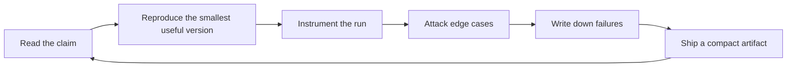

# Ruazzm

LLM systems, post-training, and agent evaluation. I spend most of my time around the boundary where model behavior becomes an engineering system: data pipelines, tool interfaces, retrieval, evals, and serving cost models.

I prefer artifacts that can be rerun and inspected. A good AI repo should leave evidence: configs, prompts, traces, tests, eval slices, latency numbers, failure cases, and notes about what did not work.

## Current Public Work

| Surface | Recent evidence | What it signals |
| --- | --- | --- |
| Upstream LLaMA-Factory patches | [Qwen3.5/3.6 tool prompt order](https://github.com/hiyouga/LLaMA-Factory/pull/10534) [multimodal collator batch index](https://github.com/hiyouga/LLaMA-Factory/pull/10535) [Ascend NPU docs link](https://github.com/hiyouga/LLaMA-Factory/pull/10537) [GLM4V video metadata](https://github.com/hiyouga/LLaMA-Factory/pull/10538) | Post-training infrastructure work where tokenizer templates, multimodal data paths, docs, and tests have to line up. |
| Profile knowledge base | [`TECHNICAL_READING_MAP.md`](docs/TECHNICAL_READING_MAP.md) [`FRONTIER_SOURCES.md`](docs/FRONTIER_SOURCES.md) [weekday radar workflow](.github/workflows/update-frontier-radar.yml) | A maintained reading map for papers, docs, and repos that change implementation choices rather than just model names. |

## Workbench

| Track | Questions I care about | Evidence I want in the repo |
| --- | --- | --- |
| Post-training | When does a reward or preference signal change behavior rather than format? | policy deltas, rejected samples, reward hacking cases, ablations |
| Reasoning and evals | When does extra thinking improve accuracy rather than verbosity? | task slices, self-consistency curves, verifier reranking, failure taxonomy |
| Agents and tools | Can an agent explain what it tried, why it retried, and where it lost state? | tool-call traces, state snapshots, recovery logs, replayable runs |
| RAG and memory | Is the answer grounded, or just confidently adjacent to retrieved text? | attribution checks, stale-context tests, entity collisions, reranker comparisons |
| Inference systems | What quality is bought by each extra token, cache entry, and batch slot? | latency/memory dashboards, cache hit rates, batching and quantization notes |
| Multimodal systems | Where do UI, video, and document models confuse space, time, or instruction scope? | frame-level failures, OCR/table probes, data-cleaning notes |

## Operating Loop

## Research Shelf

The full map lives in [`docs/TECHNICAL_READING_MAP.md`](docs/TECHNICAL_READING_MAP.md). I keep papers and docs only when they change how I would build, measure, or debug a system.

| Track | Paper anchors | Implementation anchors |
| --- | --- | --- |
| Post-training | [InstructGPT](https://arxiv.org/abs/2203.02155) [DPO](https://arxiv.org/abs/2305.18290) [DeepSeek-R1](https://arxiv.org/abs/2501.12948) | [TRL](https://huggingface.co/docs/trl) [PEFT](https://huggingface.co/docs/peft) [LLaMA Factory](https://github.com/hiyouga/LLaMA-Factory) |
| Reasoning / eval | [Self-consistency](https://arxiv.org/abs/2203.11171) [s1](https://arxiv.org/abs/2501.19393) [SWE-bench](https://arxiv.org/abs/2310.06770) | [lm-evaluation-harness](https://github.com/EleutherAI/lm-evaluation-harness) [Inspect](https://inspect.aisi.org.uk/) [OpenAI Evals](https://github.com/openai/evals) |
| Agents / tools | [ReAct](https://arxiv.org/abs/2210.03629) [Toolformer](https://arxiv.org/abs/2302.04761) [SWE-agent](https://arxiv.org/abs/2405.15793) | [MCP](https://modelcontextprotocol.io/docs/getting-started/intro) [LangGraph](https://docs.langchain.com/oss/python/langgraph/overview) [AutoGen](https://microsoft.github.io/autogen/) |
| RAG / memory | [RAG](https://arxiv.org/abs/2005.11401) [Self-RAG](https://arxiv.org/abs/2310.11511) [RAGAS](https://arxiv.org/abs/2309.15217) | [LlamaIndex](https://docs.llamaindex.ai/) [Haystack evaluation](https://docs.haystack.deepset.ai/docs/evaluation) [Ragas](https://docs.ragas.io/) |
| Inference | [PagedAttention](https://arxiv.org/abs/2309.06180) [Speculative decoding](https://arxiv.org/abs/2211.17192) [FlashAttention](https://arxiv.org/abs/2205.14135) | [vLLM](https://docs.vllm.ai/) [SGLang](https://docs.sglang.io/) [TensorRT-LLM](https://nvidia.github.io/TensorRT-LLM/) |
| Data / multimodal | [Self-Instruct](https://arxiv.org/abs/2212.10560) [LLaVA](https://arxiv.org/abs/2304.08485) [MMMU](https://arxiv.org/abs/2311.16502) | [Datasets](https://huggingface.co/docs/datasets) [Datatrove](https://github.com/huggingface/datatrove) [lmms-eval](https://github.com/EvolvingLMMs-Lab/lmms-eval) |

## Publish Standard

When I publish an experiment, I want it to include:

- exact model, checkpoint, decoding config, and tool schema,
- data construction notes or the eval slice being used,
- prompts, scoring code, and enough raw traces to inspect mistakes,
- at least one ablation that changes the conclusion if it fails,
- latency, memory, or cost notes when the result depends on serving behavior,
- and a short section on where the result probably does not generalize.

<strong>Planned artifacts</strong> - repos I want to make inspectable

| Artifact | Why it should exist |
| --- | --- |
| `reasoning-eval-lab` | Compare direct answering, thinking budgets, self-consistency, verifier reranking, and tool-assisted solving on the same slices. |
| `agent-trace-bench` | Store agent state, tool calls, retries, recovery attempts, and final failure causes in a replayable format. |
| `rag-failure-atlas` | Separate stale retrieval, citation drift, entity collision, missing context, and multi-hop failures instead of calling everything hallucination. |
| `kv-cache-playground` | Measure long-context latency and memory under prompt caching, cache quantization, compression, and batching policies. |
| `posttraining-field-notes` | Keep concise implementation notes on SFT, DPO/IPO/ORPO, RLVR, rejection sampling, reward modeling, and reward hacking. |

<strong>Frontier radar</strong> - auto-updated papers and implementation anchors

<!-- FRONTIER-RADAR:START -->
_Updated on 2026-06-19 UTC. Recent arXiv papers are filtered by track; implementation anchors keep the radar useful when a topic is quiet or rate-limited._

| Track | Recent papers | Implementation anchors |
| --- | --- | --- |
| Post-training / alignment | [Your Mouse and Eyes Secretly Leak Your Preference: LLM Alignment using Implicit Feedback from Users](http://arxiv.org/abs/2606.20482v1) (2026-06-18) [PsyScore: A Psychometrically-Aware Framework for Trait-Adaptive Essay Scoring and ZPD-Scaffolded Feedback](http://arxiv.org/abs/2606.20287v1) (2026-06-18) | [TRL docs](https://huggingface.co/docs/trl) [PEFT docs](https://huggingface.co/docs/peft) [LLaMA Factory](https://github.com/hiyouga/LLaMA-Factory) |
| Reasoning / evaluation | [StylisticBias: A Few Human Visual Cues Drive Most Social Biases in MLLMs](http://arxiv.org/abs/2606.20527v1) (2026-06-18) [Scalable Training of Spatially Grounded 2D Vision-Language Models for Radiology](http://arxiv.org/abs/2606.20477v1) (2026-06-18) | [lm-evaluation-harness](https://github.com/EleutherAI/lm-evaluation-harness) [Inspect](https://inspect.aisi.org.uk/) [OpenAI Evals](https://github.com/openai/evals) |
| Agents / tool use | [PsyScore: A Psychometrically-Aware Framework for Trait-Adaptive Essay Scoring and ZPD-Scaffolded Feedback](http://arxiv.org/abs/2606.20287v1) (2026-06-18) [MedRLM: Recursive Multimodal Health Intelligence for Long-Context Clinical Reasoning, Sensor-Guided Screening, Evidence-Grounded Decision Support, and Community-to-Tertiary Referral Optimization](http://arxiv.org/abs/2606.20164v1) (2026-06-18) | [MCP docs](https://modelcontextprotocol.io/docs/getting-started/intro) [LangGraph docs](https://docs.langchain.com/oss/python/langgraph/overview) [AutoGen docs](https://microsoft.github.io/autogen/) |
| RAG / memory | [LedgerAgent: Structured State for Policy-Adherent Tool-Calling Agents](http://arxiv.org/abs/2606.20529v1) (2026-06-18) [Scalable Training of Spatially Grounded 2D Vision-Language Models for Radiology](http://arxiv.org/abs/2606.20477v1) (2026-06-18) | [LlamaIndex docs](https://docs.llamaindex.ai/) [Haystack evaluation](https://docs.haystack.deepset.ai/docs/evaluation) [Ragas docs](https://docs.ragas.io/) [GraphRAG](https://www.microsoft.com/en-us/research/project/graphrag/) |
| Inference / serving | [TimeProVe: Propose, then Verify for Efficient Long Video Temporal Reasoning in Activities of Daily Living](http://arxiv.org/abs/2606.20561v1) (2026-06-18) [Execution-State Capsules: Graph-Bound Execution-State Checkpoint and Restore for Low-Latency, Small-Batch, On-Device Physical-AI Serving](http://arxiv.org/abs/2606.20537v1) (2026-06-18) | [vLLM docs](https://docs.vllm.ai/) [SGLang docs](https://docs.sglang.io/) [TensorRT-LLM docs](https://nvidia.github.io/TensorRT-LLM/) [llama.cpp](https://github.com/ggml-org/llama.cpp) |
| Multimodal / documents | [StylisticBias: A Few Human Visual Cues Drive Most Social Biases in MLLMs](http://arxiv.org/abs/2606.20527v1) (2026-06-18) [Scalable Training of Spatially Grounded 2D Vision-Language Models for Radiology](http://arxiv.org/abs/2606.20477v1) (2026-06-18) | [lmms-eval](https://github.com/EvolvingLMMs-Lab/lmms-eval) [VLMEvalKit](https://github.com/open-compass/VLMEvalKit) [LlamaIndex document parsing](https://docs.cloud.llamaindex.ai/) |
| Data / distillation | [StylisticBias: A Few Human Visual Cues Drive Most Social Biases in MLLMs](http://arxiv.org/abs/2606.20527v1) (2026-06-18) [Your Mouse and Eyes Secretly Leak Your Preference: LLM Alignment using Implicit Feedback from Users](http://arxiv.org/abs/2606.20482v1) (2026-06-18) | [Hugging Face Datasets](https://huggingface.co/docs/datasets) [Argilla docs](https://docs.argilla.io/) [Datatrove](https://github.com/huggingface/datatrove) |
<!-- FRONTIER-RADAR:END -->

