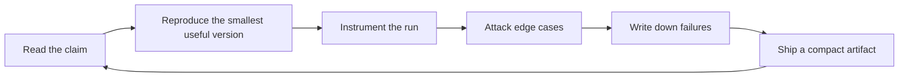

# Ruazzm

I work on LLM algorithms and systems, especially the places where a model stops being a benchmark number and starts becoming an inspectable system: post-training, reasoning-time compute, retrieval, agent traces, and serving efficiency.

My bias is simple: a good AI repo should leave evidence. Not just a demo, but the configs, prompts, traces, eval slices, latency numbers, failure cases, and notes that make the result debuggable by someone else.

## Current Workbench

| Track | Questions I care about | What I try to make visible |
| --- | --- | --- |
| Reasoning and post-training | When does extra thinking improve accuracy rather than verbosity? How do verifier and reward signals fail? | task slices, policy deltas, self-consistency curves, reward hacking examples |
| Agent systems | Can an agent explain what it tried, why it retried, and where it lost state? | tool-call traces, recovery logs, state snapshots, error taxonomies |
| Retrieval and memory | Is the answer grounded, or just confidently adjacent to retrieved text? | attribution checks, stale-context tests, entity collision cases, reranker ablations |
| Inference and serving | What quality is bought by each extra token, cache entry, and batch slot? | latency and memory dashboards, prompt-cache hit rates, KV-cache experiments |
| Multimodal models | Where do UI and video models confuse spatial state, temporal order, or instruction scope? | curated probes, frame-level failures, data-cleaning notes |

## Operating Loop

## What I Want My Public Work To Signal

- The interesting part of an LLM system is often the interface between algorithm and measurement.
- I trust experiments more when the failure cases are easier to inspect than the headline metric.
- RAG is an attribution problem before it is a prompt template.
- Agents need replayable state, not just a transcript.
- Serving details change product behavior: context length, caching, batching, routing, and token budgets all leak into UX.
- Negative results are useful when they are specific enough to save someone else a week.

## Technical Reading Map

I keep a compact map of papers and docs that change implementation choices. The longer version lives in [`docs/TECHNICAL_READING_MAP.md`](docs/TECHNICAL_READING_MAP.md).

| Track | Literature I return to | Docs I keep close |
| --- | --- | --- |
| Post-training | [InstructGPT](https://arxiv.org/abs/2203.02155) [DPO](https://arxiv.org/abs/2305.18290) [DeepSeek-R1](https://arxiv.org/abs/2501.12948) | [TRL](https://huggingface.co/docs/trl) [PEFT](https://huggingface.co/docs/peft) [LLaMA Factory](https://github.com/hiyouga/LLaMA-Factory) |
| Reasoning and eval | [Self-consistency](https://arxiv.org/abs/2203.11171) [s1](https://arxiv.org/abs/2501.19393) [SWE-bench](https://arxiv.org/abs/2310.06770) | [lm-evaluation-harness](https://github.com/EleutherAI/lm-evaluation-harness) [Inspect](https://inspect.aisi.org.uk/) [OpenAI Evals](https://github.com/openai/evals) |
| Agents and tools | [ReAct](https://arxiv.org/abs/2210.03629) [Toolformer](https://arxiv.org/abs/2302.04761) [SWE-agent](https://arxiv.org/abs/2405.15793) | [MCP](https://modelcontextprotocol.io/docs/getting-started/intro) [LangGraph](https://docs.langchain.com/oss/python/langgraph/overview) [AutoGen](https://microsoft.github.io/autogen/) |
| RAG and memory | [RAG](https://arxiv.org/abs/2005.11401) [Self-RAG](https://arxiv.org/abs/2310.11511) [RAGAS](https://arxiv.org/abs/2309.15217) | [LlamaIndex](https://docs.llamaindex.ai/) [Haystack evaluation](https://docs.haystack.deepset.ai/docs/evaluation) [Ragas](https://docs.ragas.io/) |
| Inference systems | [PagedAttention](https://arxiv.org/abs/2309.06180) [Speculative decoding](https://arxiv.org/abs/2211.17192) [FlashAttention](https://arxiv.org/abs/2205.14135) | [vLLM](https://docs.vllm.ai/) [SGLang](https://docs.sglang.io/) [TensorRT-LLM](https://nvidia.github.io/TensorRT-LLM/) |
| Multimodal and documents | [LLaVA](https://arxiv.org/abs/2304.08485) [MMMU](https://arxiv.org/abs/2311.16502) [DocVQA](https://arxiv.org/abs/2007.00398) | [lmms-eval](https://github.com/EvolvingLMMs-Lab/lmms-eval) [VLMEvalKit](https://github.com/open-compass/VLMEvalKit) [LlamaCloud parsing](https://docs.cloud.llamaindex.ai/) |
| Data and distillation | [Self-Instruct](https://arxiv.org/abs/2212.10560) [Alpaca](https://crfm.stanford.edu/2023/03/13/alpaca.html) [Magpie](https://arxiv.org/abs/2406.08464) | [Hugging Face Datasets](https://huggingface.co/docs/datasets) [Argilla](https://docs.argilla.io/) [Datatrove](https://github.com/huggingface/datatrove) |

## Project Map

| Artifact | Current shape | Why it should exist |
| --- | --- | --- |
| `reasoning-eval-lab` | eval harness design | Compare direct answering, thinking budgets, self-consistency, verifier reranking, and tool-assisted solving on the same slices. |
| `agent-trace-bench` | trace schema and failure taxonomy | Store agent state, tool calls, retries, recovery attempts, and final failure causes in a replayable format. |
| `rag-failure-atlas` | casebook and metrics | Separate stale retrieval, citation drift, entity collision, missing context, and multi-hop failures instead of calling everything hallucination. |
| `kv-cache-playground` | benchmark notes | Measure long-context latency and memory under prompt caching, cache quantization, compression, and batching policies. |
| `posttraining-field-notes` | living notes | Keep concise implementation notes on SFT, DPO/IPO/ORPO, RLVR, rejection sampling, reward modeling, and reward hacking. |

## Experiment Checklist

When I publish an experiment, I want it to include:

- exact model, checkpoint, decoding config, and tool schema,
- data construction notes or the eval slice being used,
- prompts, scoring code, and enough raw traces to inspect mistakes,
- at least one ablation that changes the conclusion if it fails,
- latency, memory, or cost notes when the result depends on serving behavior,
- and a short section on where the result probably does not generalize.

<strong>Frontier radar</strong> - auto-updated papers and implementation anchors

<!-- FRONTIER-RADAR:START -->
_Updated on 2026-06-01 UTC. Recent arXiv papers are filtered by track; implementation anchors keep the radar useful when a topic is quiet or rate-limited._

| Track | Recent papers | Implementation anchors |
| --- | --- | --- |
| Post-training / alignment | [Training language models to follow instructions with human feedback](https://arxiv.org/abs/2203.02155) [Direct Preference Optimization](https://arxiv.org/abs/2305.18290) [DeepSeek-R1: reasoning via reinforcement learning](https://arxiv.org/abs/2501.12948) | [TRL docs](https://huggingface.co/docs/trl) [PEFT docs](https://huggingface.co/docs/peft) [LLaMA Factory](https://github.com/hiyouga/LLaMA-Factory) |
| Reasoning / evaluation | [Self-Consistency Improves Chain of Thought Reasoning](https://arxiv.org/abs/2203.11171) [s1: simple test-time scaling](https://arxiv.org/abs/2501.19393) [SWE-bench](https://arxiv.org/abs/2310.06770) | [lm-evaluation-harness](https://github.com/EleutherAI/lm-evaluation-harness) [Inspect](https://inspect.aisi.org.uk/) [OpenAI Evals](https://github.com/openai/evals) |
| Agents / tool use | [ReAct: Synergizing Reasoning and Acting](https://arxiv.org/abs/2210.03629) [Toolformer](https://arxiv.org/abs/2302.04761) [SWE-agent](https://arxiv.org/abs/2405.15793) | [MCP docs](https://modelcontextprotocol.io/docs/getting-started/intro) [LangGraph docs](https://docs.langchain.com/oss/python/langgraph/overview) [AutoGen docs](https://microsoft.github.io/autogen/) |
| RAG / memory | [Retrieval-Augmented Generation](https://arxiv.org/abs/2005.11401) [Self-RAG](https://arxiv.org/abs/2310.11511) [RAGAS](https://arxiv.org/abs/2309.15217) | [LlamaIndex docs](https://docs.llamaindex.ai/) [Haystack evaluation](https://docs.haystack.deepset.ai/docs/evaluation) [Ragas docs](https://docs.ragas.io/) [GraphRAG](https://www.microsoft.com/en-us/research/project/graphrag/) |
| Inference / serving | [PagedAttention / vLLM](https://arxiv.org/abs/2309.06180) [Speculative Decoding](https://arxiv.org/abs/2211.17192) [FlashAttention](https://arxiv.org/abs/2205.14135) | [vLLM docs](https://docs.vllm.ai/) [SGLang docs](https://docs.sglang.io/) [TensorRT-LLM docs](https://nvidia.github.io/TensorRT-LLM/) [llama.cpp](https://github.com/ggml-org/llama.cpp) |
| Multimodal / documents | [LLaVA](https://arxiv.org/abs/2304.08485) [MMMU](https://arxiv.org/abs/2311.16502) [DocVQA](https://arxiv.org/abs/2007.00398) | [lmms-eval](https://github.com/EvolvingLMMs-Lab/lmms-eval) [VLMEvalKit](https://github.com/open-compass/VLMEvalKit) [LlamaIndex document parsing](https://docs.cloud.llamaindex.ai/) |
| Data / distillation | [Self-Instruct](https://arxiv.org/abs/2212.10560) [Alpaca](https://crfm.stanford.edu/2023/03/13/alpaca.html) [Magpie](https://arxiv.org/abs/2406.08464) | [Hugging Face Datasets](https://huggingface.co/docs/datasets) [Argilla docs](https://docs.argilla.io/) [Datatrove](https://github.com/huggingface/datatrove) |
<!-- FRONTIER-RADAR:END -->

## Reading Filter

I keep a paper, model release, or engineering note only if it changes at least one implementation choice: the training recipe, inference-time algorithm, tool interface, evaluation method, serving cost model, or failure analysis.
